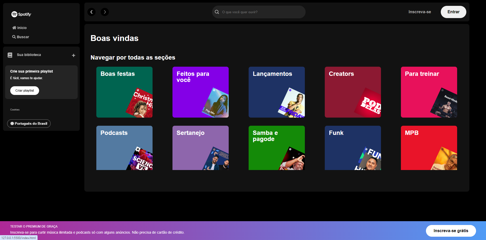

# Resumo do projeto
Esse projeto foi feito assistindo a Imersão Front-End da Alura, visando aprender sobre as tecnologias mais usadas no desenvolvimento web.

## ✔️ Técnicas e tecnologias utilizadas

- ``HTML``
- ``CSS3``
- ``JavaScript``